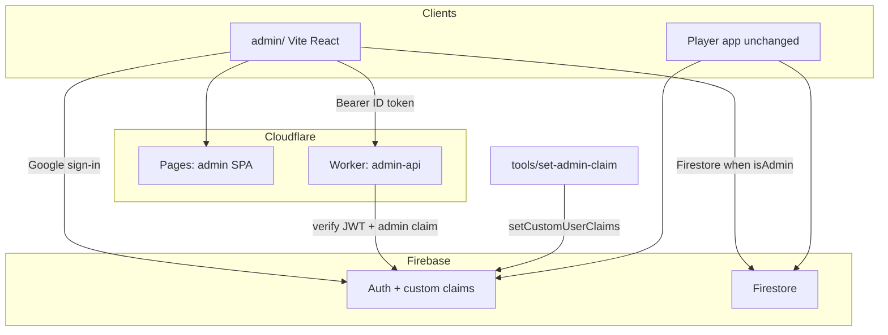

# Admin panel foundation — design

Date: 2026-09-26  
Status: approved; plan ready  
References: [notifications design](2026-09-24-notifications-design.md) (announcements via admin later), [profile redesign](2026-09-24-profile-screen-redesign-design.md) (admin UI to read reports deferred), [R2 avatar upload](2026-09-25-r2-avatar-upload-design.md) (Worker Firebase JWT pattern), [FIREBASE.md](../../../FIREBASE.md)

## Goal

Ship the shared **host, auth, and API gate** for the Winklo admin platform so later modules (issue reports, FCM announcements, ops console, broader platform) plug into one app. This sub-project does **not** implement those modules.

## Roadmap (separate specs)

| Phase | Scope |
|-------|--------|
| **1 — Foundation (this)** | SPA shell, custom claims, Worker `/v1/me`, Firestore `isAdmin()` helper, claim script |
| 2 — Issue reports | Admin read/triage of `issue_reports` |
| 3 — Announcements | FCM to `announcements` / `app_updates` via Worker |
| 4 — Ops | Remote Config / force update, leaderboard debug, content seeds |
| 5 — Platform | Users, moderation, analytics, content CMS (likely multiple specs) |

## Product decisions

| Topic | Choice |
|-------|--------|
| Approach | Hybrid shell (client Firestore when rules allow + privileged Worker API) |
| App location | Separate repo [winklo-admin](https://github.com/MuhammedFaseenCM/winklo-admin) (Vite + React + TypeScript); Worker + claim tooling live there |
| Deploy UI | Cloudflare Pages |
| Auth | Same Firebase project as the player app; Google sign-in |
| Authorization | Custom claim `admin: true` |
| Grant / revoke | `tools/set-admin-claim` (Firebase Admin SDK); not self-serve |
| Client data | Firebase JS SDK when rules allow `isAdmin()` |
| Privileged API | `workers/admin-api` (JWT + claim check) |
| Player app | Unchanged; no in-app admin UI |

## Out of scope

- Reading or updating `issue_reports`
- Sending FCM or writing Remote Config
- Multi-role RBAC, invite UI, audit log UI
- Flutter / Android changes
- Custom domain for the admin SPA

## Architecture

```
Admin SPA (Cloudflare Pages) — repo: winklo-admin
  ├─ Google sign-in → Firebase Auth
  ├─ Gate on ID token claim admin === true
  ├─ Firestore (later phases) when rules allow isAdmin()
  └─ Bearer ID token → workers/admin-api (same winklo-admin repo)
       └─ verify JWT (JWKS) + require admin claim
            └─ GET /v1/me → { uid, email?, admin: true }

tools/set-admin-claim (winklo-admin) → Firebase Admin setCustomUserClaims({ admin: true|false })
```



## Auth and authorization

1. Operator opens the admin SPA and signs in with Google (Firebase Auth).
2. After sign-in, the client refreshes the ID token and checks `getIdTokenResult().claims.admin === true`.
3. If not admin: show **Access denied** (signed in but unauthorized); offer sign-out. Do not render the app shell.
4. If admin: enter the shell; attach `Authorization: Bearer <ID token>` on Worker calls.
5. After grant/revoke via the claim script, the operator must sign out/in (or force token refresh) so the claim appears on the ID token.

**Claim shape (v1):** `{ admin: true }` only — no roles matrix.

**Worker verification:** Reuse the JWKS pattern from `workers/avatar-upload/src/firebase_auth.ts` (verify Firebase ID token for the project). Then require `payload.admin === true`. Responses:

| Condition | HTTP |
|-----------|------|
| Missing or invalid token | `401` |
| Valid user, not admin | `403` |
| Admin OK | `200` (for `/v1/me`) |

Admin SPA (`admin/` in [winklo-admin](https://github.com/MuhammedFaseenCM/winklo-admin))

### Routes

| Path | Behavior |
|------|----------|
| `/login` | Google sign-in; redirect to `/` if already admin |
| `/` | Dashboard home (placeholder cards linking to modules) |
| `/reports` | Stub: coming in next phase |
| `/announcements` | Stub |
| `/ops` | Stub |
| `/platform` | Stub |
| `*` | Redirect to `/` or `/login` |

### Shell

- Nav: Dashboard, Reports, Announcements, Ops, Platform (desktop side nav; compact top nav on narrow viewports)
- Header: operator email (and photo if available) + Sign out
- Auth gate: loading → login → access denied → shell

### Config

- Vite env: `VITE_FIREBASE_*` for the existing Firebase project; `VITE_ADMIN_API_BASE_URL` for the Worker
- Firebase Console: add the Pages hostname (and `localhost` for dev) under Auth authorized domains

### UI bar

Functional ops chrome: light theme, clear layout, readable for future tables. Not a marketing page; no dependency on the Flutter design system.

## Worker `workers/admin-api`

| Item | Detail |
|------|--------|
| Wrangler name | `winklo-admin-api` |
| Auth helper | `verifyAdmin(request)` — JWT + `admin` claim |
| Endpoints | `GET /v1/me` → `{ uid, email?: string, admin: true }` |
| CORS | Allow admin Pages origin(s) and local Vite origin only |
| Vars | `FIREBASE_PROJECT_ID` (same project as avatar Worker) |

No Firestore Admin SDK and no service-account secret in the Worker for foundation. Privileged Admin SDK usage (FCM, etc.) lands in later phases when those features need it.

## Firestore rules

Add helpers only:

```
function isAdmin() {
  return isSignedIn() && request.auth.token.admin == true;
}
```

Do **not** open `issue_reports` (or other) admin reads in this phase. Phase 2 adds `allow read: if isAdmin()` on `issue_reports`. Document that intent in `FIREBASE.md` / admin README.

## Claim tooling

`tools/set-admin-claim.mjs` using existing `firebase-admin` in `tools/`:

```bash
node tools/set-admin-claim.mjs --email you@example.com --admin true
node tools/set-admin-claim.mjs --email you@example.com --admin false
node tools/set-admin-claim.mjs --uid <uid> --admin true
```

Use the same service-account / credentials pattern as existing seed scripts. Print a reminder to refresh the ID token after changing claims.

## Deploy and local dev

| Piece | Local | Prod |
|-------|-------|------|
| SPA | `cd admin && npm run dev` | Cloudflare Pages from `admin/` |
| Worker | `wrangler dev` in `workers/admin-api` | `wrangler deploy` |
| Claims | Script against the real Firebase project | Same |

SPA env points `VITE_ADMIN_API_BASE_URL` at local wrangler or the deployed Worker.

## Error handling

| Case | Behavior |
|------|----------|
| Firebase Auth fails | Error on login; retry |
| Signed in, no `admin` claim | Access denied page; no shell |
| Worker `401` / `403` on `/v1/me` | Treat as unauthorized / session issue; do not treat as admin |
| Worker unreachable | Always call `/v1/me` once on shell enter. On network failure: if the client ID token has `admin`, show the shell plus a non-blocking “API unavailable” banner; if the client lacks the claim, stay on Access denied |

## Testing

| Layer | Coverage |
|-------|----------|
| Worker | Missing token → `401`; non-admin token → `403`; admin claim → `200` `/v1/me` |
| SPA | Manual checklist for auth gate states (loading / login / denied / shell); no automated SPA test suite in this phase |
| Rules | No new allow paths; existing rules tests unchanged |
| Manual | Grant claim → login → shell; revoke → access denied after refresh |

## Success criteria

1. Operator with `admin: true` can sign in on the SPA and see the shell and nav stubs.
2. Operator without the claim sees Access denied.
3. `GET /v1/me` with an admin token returns `200`; without the claim returns `403`.
4. Claim script can grant and revoke by email or uid.
5. Player app behavior and player Firestore permissions are unchanged.
6. Docs cover granting claims, local run, and deploying Pages + Worker.

## Docs to update when implementing

- [winklo-admin](https://github.com/MuhammedFaseenCM/winklo-admin) README — local run, env vars, deploy, claim grant flow
- `FIREBASE.md` (this repo) — custom claims + `isAdmin()` helper; note phase-2 report reads
- Pointer only: admin code is **not** under this monorepo
